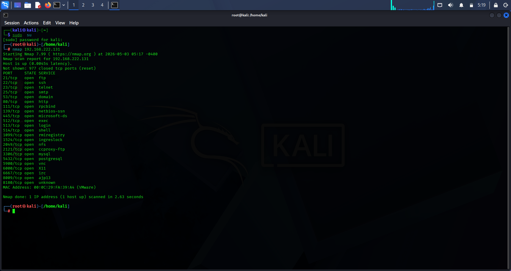
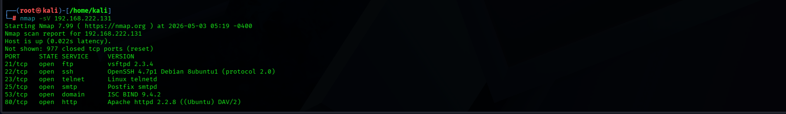
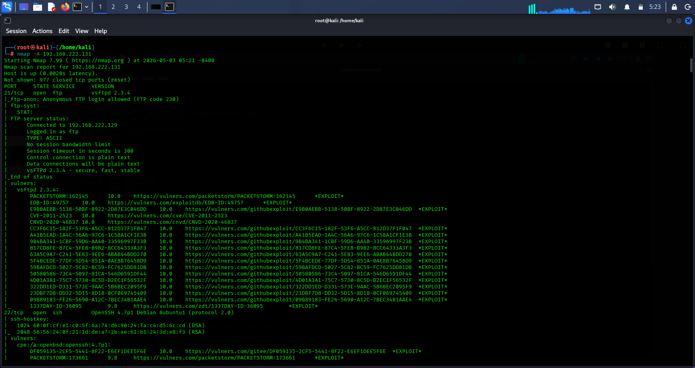
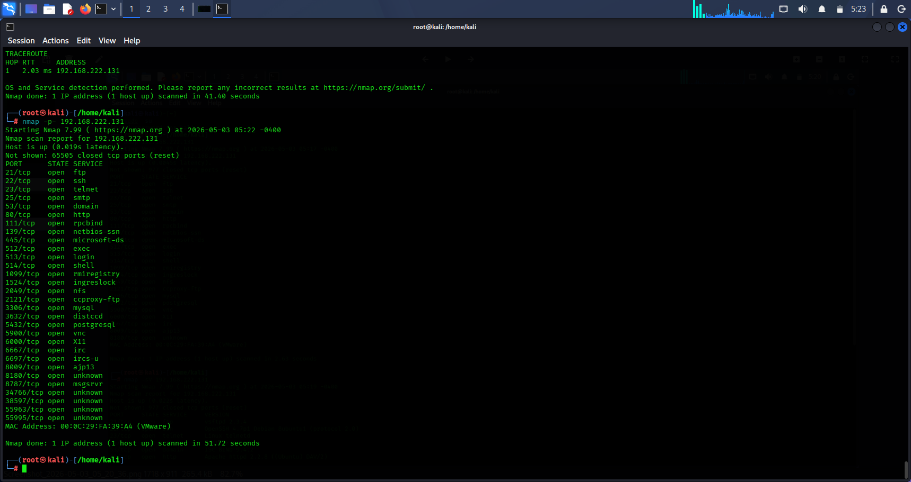
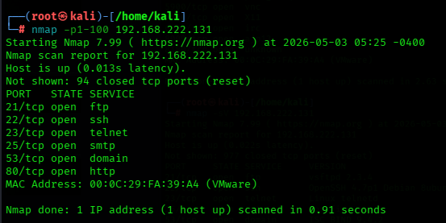
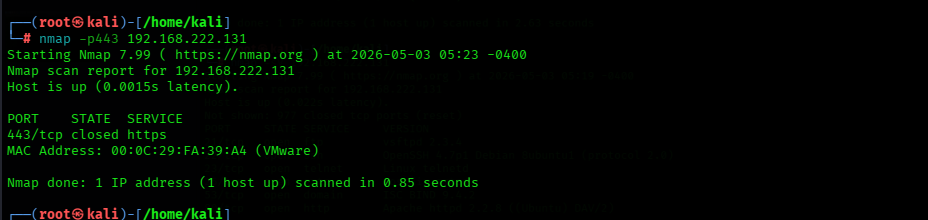

# Network Scanning & Enumeration Lab

## Objective
To perform network scanning and service enumeration on a target system in a controlled lab environment using Nmap.

## Tools Used
- Nmap
- Kali Linux
- Metasploitable

## Target
- IP Address: 192.168.222.131

## Scanning Techniques

### 1. Basic Scan
Command:

```
nmap 192.168.222.131
```

Purpose:
To identify open ports on the target system.

This scans revealed several open ports exposing active services on the target system:

1. FTP (Port 21) – File Transfer Service detected
2. SSH (Port 22) – Secure remote access service
3. HTTP (Port 80) – Web server service running
4. SMB (Ports 139/445) – File sharing services exposed
# These exposed services significantly increase the attack surface of the system.

### 2. Service Version Detection
Command:

```
nmap -sV 192.168.222.131
```

Purpose:
To detect running services and their versions.

Service version detection (nmap -sV) revealed that:
1. Some services may be running outdated or default configurations
2. FTP and HTTP services potentially expose unnecessary information via service banners
3. SSH service is exposed and could be targeted via brute-force attacks if weak credentials exist
# This increases the risk of credential-based and service exploitation attacks.

### 3. Aggressive Scan
Command:

```
nmap -A 192.168.222.131
```

Purpose:
To perform OS detection, version detection, script scanning, and traceroute.

The aggressive scan (nmap -A) provided deeper system insight:
1. Operating system fingerprinting identified a Linux-based system
2. Additional service metadata was revealed through NSE scripts
3. Active network services confirmed multiple exposed entry points
# This level of visibility could assist an attacker in planning targeted exploitation.

### 4. Full Port Scan
Command:

```
nmap -p- 192.168.222.131
```

Purpose:
To scan all 65535 ports for hidden services.

### 5. Specific port scan
command:

```
nmap -p443 192.168.222.131
```

purpose:
To scan if port 443 is open

### 6. Range port scan
command:

```
nmap -p1-100 192.168.222.131
```

purpose:
To scan from port 1 to port 100

1. Full port scan (-p-) confirmed additional services beyond default ports
2. Port range scan (-p1-100) validated early-stage service exposure
3. Specific port scan (-p443) confirmed HTTPS was not actively exposed
# This indicates partial service exposure but insufficient hardening.

## Findings & Analysis
During the network scanning and enumeration process, the target system (192.168.222.131) was assessed using multiple Nmap techniques to identify exposed services, potential attack surfaces, and security weaknesses.

  ## SCREENSHOTS

### Basic Scan


### Service Detection


### Aggressive Scan


### All port scan


### Range Scan


### Specific Port Scan



#### SECURITY RISKS & IDENTIFIED

The following security concerns were observed:
1. Multiple unnecessary open ports increasing attack surface
2. Potential exposure to brute-force attacks (SSH/FTP)
3. Possible outdated service versions vulnerable to known exploits
4. Lack of visible network filtering or access restriction controls


### RECOMMENDATION

To improve system security posture, the following actions are recommended:
1. Disable unused services and close unnecessary ports
2. Enforce strong authentication policies for SSH and FTP
3. Regularly update and patch all running services
4. Implement firewall rules to restrict external access
5. Minimize service banner information exposure

### CONCLUSION

The target system exposes multiple services that increase its attack surface. While no direct exploitation was performed, the enumeration results highlight several potential entry points that could be leveraged in a real attack scenario. Proper hardening and service minimization are strongly recommended.

### Disclaimer

All activities, scans, exploitations, and simulations demonstrated in this repository were conducted in a controlled lab environment for educational and ethical purposes only. The target systems used were intentionally vulnerable systems owned for testing. Unauthorized testing against real-world systems is illegal and unethical.
